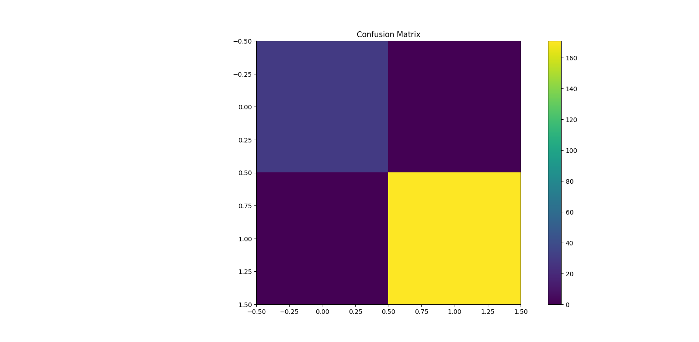

# Predictive Modeling Using Machine Learning

## Objective
The objective of this project is to build a machine learning model that predicts student outcomes based on performance data. The project demonstrates model training, testing, evaluation, and visualization techniques.

## Tools Used
- Python
- Pandas
- Scikit-learn
- Matplotlib
- VS Code
- GitHub

## Dataset
Students Performance Dataset

## Machine Learning Algorithm
- Decision Tree Classifier

## Project Steps
1. Loaded the dataset using Pandas.
2. Performed data preprocessing and encoding.
3. Split the dataset into training and testing sets.
4. Trained the Decision Tree model.
5. Predicted outcomes on test data.
6. Evaluated model accuracy.
7. Generated a confusion matrix for performance analysis.

## Model Evaluation
- Accuracy Score
- Confusion Matrix

## Output

### Confusion Matrix

## Findings
- The model successfully predicted student outcomes.
- Decision Tree classification provided good accuracy.
- The confusion matrix helped evaluate model performance.
- Machine learning techniques can be used to make predictions from educational data.

## Outcome
This project provided hands-on experience in supervised machine learning, model training, testing, and evaluation using Python and Scikit-learn.
